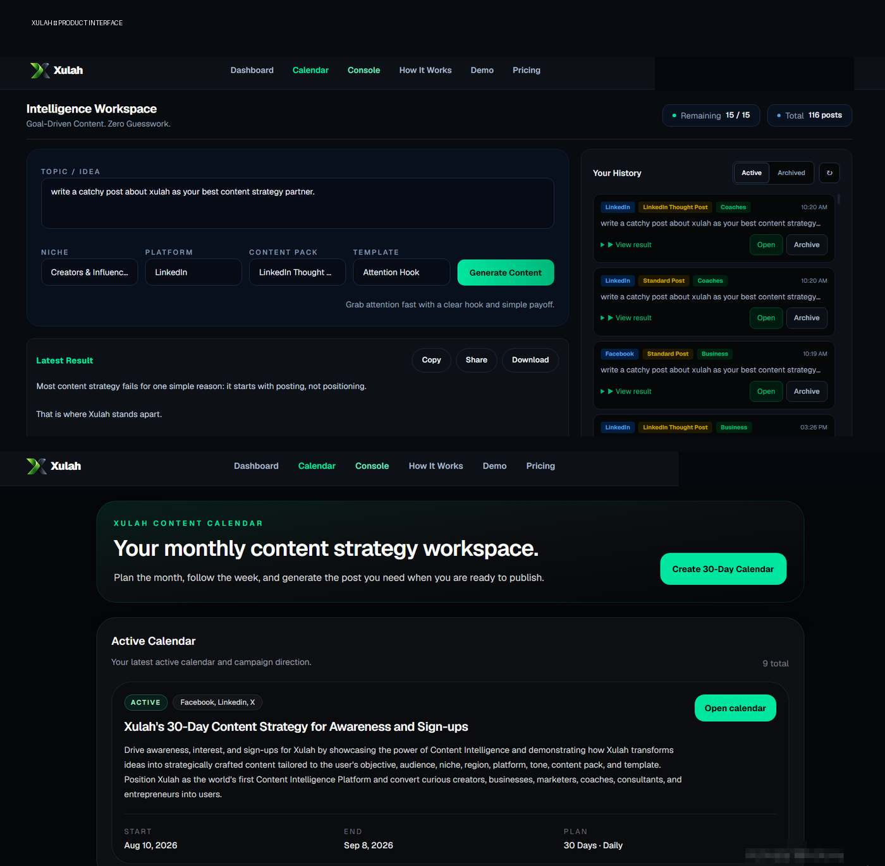
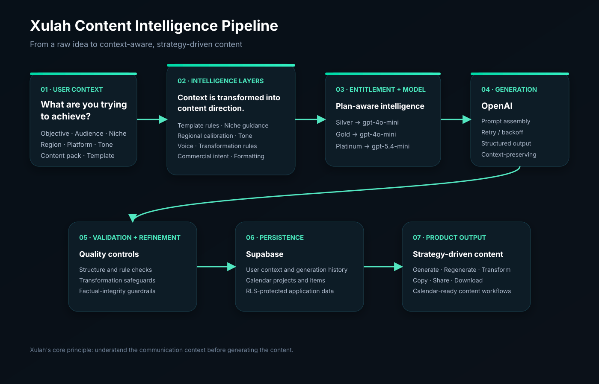

# Xulah

## Content Intelligence Platform

**Live product:** https://xulah.com  
**Product builder:** Chigozie Nwokoro  
**Production source:** Private

Xulah is a Content Intelligence Platform built for creators, businesses, entrepreneurs, marketers, coaches, consultants, e-commerce brands, community leaders, and other content-driven professionals.

Rather than treating content generation as a simple prompt-and-output exercise, Xulah considers the context behind what the user is trying to achieve. It combines **objective, audience, niche, region, platform, tone, content pack, and selected template** to determine an appropriate content direction and produce strategy-driven content.

The goal is simple: **users should not need prompting expertise to create intelligent content for their brand, product, service, or audience.** The intelligence is built into the product.

## What I Built

I designed and built Xulah, developed its product implementation roadmap, and took the product from concept and MVP through a continuously evolving live application.

My work covered product planning, frontend and backend development, database design, authentication, AI integration, subscription architecture, regional payment processing, security and abuse-prevention mechanisms, API integrations, deployment, testing, debugging, and ongoing product refinement.

Xulah includes authenticated workspaces, subscription entitlements, regional payment flows, AI-powered content generation, a 30-day content calendar, media integrations, usage controls, account/device security, and an administrative Intelligence Circle environment.

## Product Interface

The production application brings the intelligence workflow and strategic calendar together in a working SaaS experience.

## Technology Stack

| Area | Technologies |
|---|---|
| Application | Next.js 16, React 19, TypeScript |
| Styling | Tailwind CSS 4, PostCSS |
| Backend | Next.js Route Handlers, Node.js, TypeScript |
| Database & Auth | Supabase, PostgreSQL, Supabase Auth, Row Level Security |
| AI | OpenAI API |
| Payments | Stripe, Paystack |
| Media | Unsplash, Pexels |
| Email | Resend, Brevo integration |
| Source Control | GitHub |
| Deployment | Vercel |
| Domain / DNS | Cloudflare, Namecheap |
| Package Workflow | pnpm |

## Architecture

Xulah uses a **Next.js App Router** architecture with React and TypeScript on the application layer, server-side route handlers for backend operations, and Supabase for authentication and persistent application data.

Reusable server-side libraries handle content templates and rules, prompt layers, calendar generation and validation, entitlement resolution, device security, Supabase clients, Stripe and Paystack billing, media providers, and Intelligence Circle services.

## Content Intelligence Engine

Xulah is intentionally not a generic prompt wrapper. A topic is only the starting point. Before generation, the application uses the user's selected context to determine how the content should be approached.

The intelligence layers include:

- **Objective** — what the content is intended to achieve
- **Audience** — who the communication is intended for
- **Niche** — the domain and context in which the message operates
- **Region** — regional language, market, and communication calibration
- **Platform** — the destination and its content conventions
- **Tone** — the desired communication style
- **Content pack** — the selected content strategy/direction
- **Template** — the structural and creative framework for the output
- **Voice and transformation rules** — how content should sound and how an existing output should be changed
- **Commercial intent and formatting rules** — how the final content should support the intended action without sacrificing structural requirements

The result is a contextual content workflow rather than a simple `topic → prompt → response` pipeline.

The core principle is: **understand the communication context before generating the content.**

Xulah also includes guardrails intended to prevent fabricated statistics, testimonials, discounts, scarcity, stock information, and unsupported business claims during content transformations.

## AI Infrastructure

Xulah integrates the OpenAI API through the official OpenAI Node package.

Current subscription-aware model allocation:

- **Silver:** `gpt-4o-mini`
- **Gold:** `gpt-4o-mini`
- **Platinum:** `gpt-5.4-mini`

The 30-day calendar agent also uses `gpt-4o-mini` with a versioned prompt identifier.

The model allocation is part of the product's subscription architecture. During development, repeated refinement of the higher-tier intelligence still produced outputs that were too close to the lower tier. The solution was to introduce a higher-capability model for Platinum so the plan difference was reflected not only in limits and features, but also in generation capability.

Selected transient OpenAI network failures are handled with bounded retries, exponential backoff, and jitter.

## 30-Day Content Intelligence Calendar

The 30-Day Content Calendar extends Xulah from on-demand content generation into a **monthly content execution system**.

A user can provide one topic around a brand, product, service, campaign, or area of expertise and have Xulah generate a month of intelligent, recraftable content. Instead of repeatedly deciding what to post every day, the user can return to the calendar, open the day's item, generate the content, and publish it to the preferred platform.

The intended workflow is deliberately simple:

**Create calendar → open today's item → generate → copy → publish.**

This shifts much of the recurring ideation and planning burden from the user to Xulah while preserving the user's control over when and where the content is published.

The calendar is suitable for use cases including:

- product and brand campaigns
- consistent brand advertising
- entrepreneurs and personal brands
- coaches and consultants
- community and group leaders
- religious leaders
- professionals who need sustained audience communication

It supports **Instagram, Facebook, LinkedIn, X, and TikTok**, with formats including captions, carousels, short-video scripts, stories, threads, and LinkedIn posts.

Content planning can incorporate pillars such as awareness, education, authority, story, proof, objection, engagement, offer, and conversion.

### Calendar generation workflow

The calendar does not depend on one large, unvalidated AI response. Its generation flow is staged:

1. Generate a strategy structure.
2. Validate the strategy.
3. Generate the calendar plan.
4. Parse and validate the returned plan.
5. Recover missing days when necessary.
6. Repair invalid individual items where possible.
7. Fall back to broader plan repair when required.
8. Persist model, prompt version, snapshots, validation results, errors, and completion information.

This approach treats AI-generated structured data as something that must be validated, repaired, and persisted reliably.

## Authentication & Authorization

Supabase Auth provides email/password registration, login, email confirmation, password recovery/reset, session validation, and protected application routes.

Role-aware authorization includes `user`, `admin`, and `developer` roles, with privileged role data kept server-controlled.

## Data & Supabase

Supabase is the core application data and authentication layer. I designed the Xulah database with implementation guidance and used it as the application's source of truth for users and core product state.

The database stores and supports information related to users, activity, authentication, devices, subscriptions, calendar projects and items, generation history, and other application data.

Row Level Security is used as an additional security layer, with ownership controls applied to protected application data. Sensitive device-security operations are handled through controlled backend/service-role access where required by the architecture.

## Subscription & Payments

Xulah supports **Free, Silver, Gold, and Platinum** plan states through a central entitlement system that determines effective plan, usage allowance, paid status, trial status, and regional onboarding.

### Stripe

Stripe was the original payment path because Xulah was initially conceived primarily for US and UK creators and users. The integration includes checkout, billing portal, subscription synchronization/resynchronization, plan-price mappings, signed webhook processing, and subscription lifecycle handling.

### Paystack

As the product evolved toward stronger Nigerian and African adoption, Paystack was added to provide a more practical local payment path. Stripe is not a reliable payment option for many Nigerian debit-card users, so Xulah introduced regional payment routing.

During onboarding, the user's selected region determines the payment provider:

- **Nigeria → Paystack**
- **US / UK / Other → Stripe**

The provider decision is part of the application's regional product logic rather than requiring users to choose a payment service manually.

Payment state is not trusted solely from the browser. Signed provider webhooks are used to independently verify payment and subscription lifecycle events before application state is updated.

## Security & Abuse Prevention

Because every AI generation consumes paid model credits, uncontrolled account sharing can create a direct operating-cost problem. Xulah therefore includes application-level controls intended to reduce account abuse and unauthorized resource consumption.

Implemented controls include:

- one-active-device account binding
- server-side device hashing
- device mismatch detection
- device transfer challenges
- six-digit OTP transfer verification
- OTP expiry and attempt limits
- forced logout behaviour after successful device transfer
- email-confirmation enforcement for relevant trial flows
- server-side entitlement checks
- Row Level Security for protected data
- signed Stripe and Paystack webhook verification
- security-event recording

The device-transfer mechanism is designed so that, once an account is successfully bound or transferred through the verification flow, the account cannot simply be used concurrently across arbitrary devices.

Security and abuse testing is an ongoing part of product development.

## A Real Architecture Problem: RLS and Device Security

One of the most difficult engineering problems encountered during Xulah development occurred after Row Level Security was enabled on the `user_device_bindings` table.

The change exposed an important architectural dependency: `user_device_bindings` was not an isolated security table. It participated directly or indirectly in shared application infrastructure affecting:

- login
- device-aware authentication
- device transfer
- forced logout
- OTP verification
- entitlement checks
- trial activation
- AI content-generation access
- calendar navigation exposure
- authenticated API request flow

The investigation revealed a mixed architecture involving backend service-role access, authenticated-user Supabase access, shared authentication/device middleware, and centralized device-security enforcement.

### Resolution approach

Device-binding operations were refactored toward controlled **service-role/admin access**, reducing inappropriate coupling between user-scoped database access and backend security infrastructure.

The change required dependency mapping, middleware redesign, staged migration, and repeated testing of affected flows.

After each relevant RLS/security modification, the following flows were tested:

- login
- device transfer
- OTP generation
- OTP verification
- forced logout
- trial activation
- AI content generation
- navigation exposure

Additional device-security tables, including `device_transfer_otps`, `device_transfer_challenges`, and `device_security_events`, were hardened without breaking the production flows that depend on them.

This incident reinforced an important engineering lesson: **database security policies can expose architectural coupling that is invisible when individual tables are considered in isolation.**

## Key Engineering Decisions

### Build intelligence into the product instead of requiring prompt expertise

The product was designed around the idea that a user should be able to create effective content without becoming an expert prompt engineer. Context is collected through structured product choices and translated into intelligence layers, templates, voice rules, transformations, and generation instructions.

### Use regional payment routing

Supporting Nigerian users required more than adding another checkout button. The payment architecture was designed so regional selection determines the appropriate provider, allowing the product to serve both international and Nigerian users through the payment infrastructure best suited to them.

### Treat AI output as data that needs validation

The calendar system assumes that model output can be incomplete or malformed. Parsing, validation, repair, recovery, bounded attempts, and persisted diagnostics were therefore designed around the AI workflow rather than added as an afterthought.

### Protect paid AI resources

Device binding and entitlement checks were designed in response to the economics of an AI SaaS product. Security is not only about protecting user accounts; it also protects the finite model resources the application pays for on every generation.

### Separate sensitive backend security operations

The RLS/device-binding incident demonstrated that security-sensitive operations sometimes need a controlled backend boundary rather than direct authenticated-user database access. The architecture was adjusted accordingly and tested across dependent flows.

## Development & Debugging Approach

Xulah has been developed through AI-assisted software development, but the product direction and engineering decisions remain human-driven.

When something fails, the first step is usually to inspect the error message and development output carefully. When the cause is not obvious, I use Codex to inspect the relevant code and identify likely failure points.

The proposed fix is then treated as an engineering discussion rather than accepted automatically. I evaluate the approach, question trade-offs, brainstorm alternatives, and ask how the same problem would be approached professionally. If the proposed implementation does not make sense for the product, I challenge it and iterate on the design before allowing the code to be written.

In this workflow, AI is primarily the implementation accelerator. **I provide the product reasoning, constraints, decisions, arguments, and direction; AI helps translate those decisions into code and investigate problems faster.**

## Development & Iteration

Xulah has been developed through continuous implementation, testing, debugging, and refinement. The implementation history includes work on calendar validation and repair, generation limits, commercial content intent, Paystack synchronization, Stripe billing and webhook mapping, device-transfer edge cases, trial entitlement alignment, production build issues, responsive/mobile refinement, PWA work, branding, and routing.

## What This Project Demonstrates

- product ideation and roadmap development
- full-stack web application development
- TypeScript and Next.js
- backend API design
- database design and data modelling
- authentication and authorization
- AI/API integration
- prompt and intelligence architecture
- subscription SaaS design
- regional payment architecture
- Stripe and Paystack integrations
- webhook-driven payment verification
- security and abuse prevention
- Row Level Security and backend access boundaries
- structured AI workflows
- AI output validation and recovery
- deployment and infrastructure configuration
- debugging and iterative product development
- AI-assisted engineering with human-led technical decision making

## Development Philosophy

Xulah was built through **AI-assisted software development**, while the product direction, roadmap, implementation decisions, integrations, testing, debugging, and deployment were owned and driven by me.

The project represents hands-on learning through building: identifying a product problem, translating it into systems and features, implementing those systems, testing them against real-world behaviour, finding weaknesses, and iterating toward a usable product.

## Current Status

Xulah is a live, actively developed product.

**Visit:** https://xulah.com

The production source repository is intentionally private. This public repository is a **portfolio and technical case study**, not an open-source copy of Xulah's production codebase.

## About the Builder

**Chigozie Nwokoro** is a Computer Science professional and independent product builder currently pursuing a Post-Graduate Diploma in Computer Science at Enugu State University of Science and Technology (ESUT).

**LinkedIn:** https://www.linkedin.com/in/chigozie-nwokoro-4a075a43/  
**GitHub:** https://github.com/Bolambo  
**Live Product:** https://xulah.com
